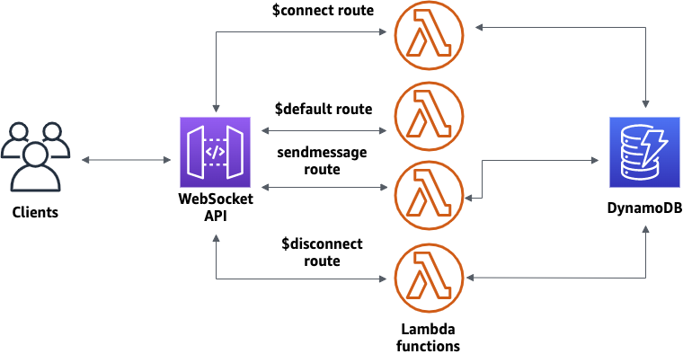
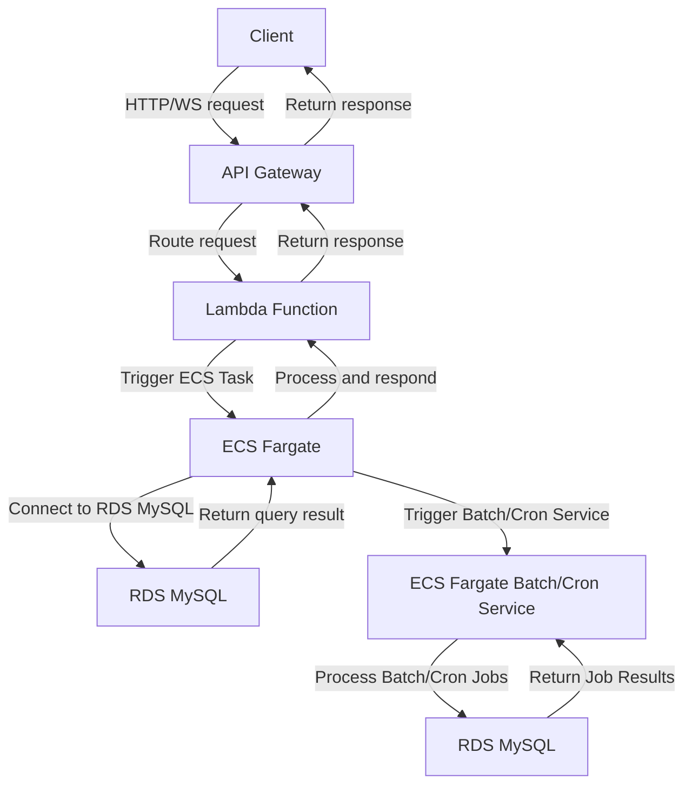

# I have system aws api gateway and ecs fargate for running nodejs application 

## Establishing infra for system.

I want to use Vpc link to connect to my API gateway to my ecs fargate for socket connection. Script terraform for create vpc link and connect to my api gateway.

```js
provider "aws" {
  region = "us-west-2"
}

resource "aws_vpc_link" "example" {
  name        = "example"
  description = "an example vpc link"
  target_arns = ["arn:aws:execute-api:us-west-2:123456789012:random/api-id/stage-name"]

  tags = {
    Name = "example"
  }
}

resource "aws_api_gateway_vpc_link" "example" {
  name        = "example"
  description = "an example vpc link for api gateway"
  target_arns = [aws_vpc_link.example.arn]
  subnet_ids  = ["subnet-0abcd1234efgh5678", "subnet-1abcd1234efgh5678"]
}

# Step 1: API Gateway with WebSocket integration
resource "aws_api_gatewayv2_api" "websocket_api" {
  name          = "your_websocket_api_name"
  protocol_type = "WEBSOCKET"
}

# Step 2: WebSocket route
resource "aws_api_gatewayv2_route" "websocket_route" {
  api_id    = aws_api_gatewayv2_api.websocket_api.id
  route_key = "$default"
  target    = "integrations/${aws_lambda_function.websocket_lambda_function.name}"
}

# Step 3: Integration with Lambda for handling WebSocket connections
resource "aws_lambda_function" "websocket_lambda_function" {
  function_name = "your_websocket_lambda_function_name"
  runtime       = "nodejs14.x"  # or any other runtime compatible with your WebSocket application
  handler       = "index.handler"
  filename      = "path/to/your/lambda_function.zip"
}

resource "aws_lambda_permission" "websocket_lambda_permission" {
  statement_id  = "AllowExecutionFromAPIGateway"
  action        = "lambda:InvokeFunction"
  function_name = aws_lambda_function.websocket_lambda_function.function_name
  principal     = "apigateway.amazonaws.com"
}

# Step 4: API Gateway integration response for WebSocket
resource "aws_api_gatewayv2_integration" "websocket_integration" {
  api_id                  = aws_api_gatewayv2_api.websocket_api.id
  integration_type        = "AWS_PROXY"
  integration_method      = "POST"
  integration_uri         = aws_lambda_function.websocket_lambda_function.invoke_arn
}

# Step 5: Deployment of WebSocket API
resource "aws_api_gatewayv2_deployment" "websocket_deployment" {
  api_id = aws_api_gatewayv2_api.websocket_api.id
}

# Step 6: Stage for WebSocket API
resource "aws_api_gatewayv2_stage" "websocket_stage" {
  api_id    = aws_api_gatewayv2_api.websocket_api.id
  name      = "your_stage_name"
  auto_deploy = true
}

# Step 7: Output the WebSocket API endpoint URL
output "websocket_api_endpoint" {
  value = aws_api_gatewayv2_api.websocket_api.api_endpoint
}

resource "aws_ecs_task_definition" "task" {
  family                   = "your_task_family"
  cpu                      = "256"
  memory                   = "512"
  network_mode             = "awsvpc"

  container_definitions = jsonencode([
    {
      name  = "your_nestjs_container_name"
      image = "your_nestjs_image"  # Update with your built Docker image
      portMappings = [
        {
          containerPort = 3000  # Assuming NestJS app runs on port 3000
          hostPort      = 3000
        }
      ]
    }
  ])
}

resource "aws_ecs_service" "service" {
  name            = "your_nestjs_service_name"
  cluster         = aws_ecs_cluster.cluster.id
  task_definition = aws_ecs_task_definition.task.arn
  desired_count   = 1
  launch_type     = "FARGATE"

  network_configuration {
    subnets         = ["your_subnet_id"]
    security_groups = ["your_security_group_id"]
    assign_public_ip = true
  }
}

resource "aws_dynamodb_table" "table" {
  name           = "your_table_name"
  billing_mode   = "PAY_PER_REQUEST"
  hash_key       = "Id"

  attribute {
    name = "Id"
    type = "N"
  }
}
```


I want to setting path /socket.io for socket connection, write script terraform for setting path /socket.io for socket connection and point to my ecs fargate ?

write mermaid code for desmontrate how to connect api gateway to ecs fargate for socket connection



## Build docker image for nodejs application.


This step assumes you have a Dockerfile in the root of your NestJS project directory
You can customize this according to your project structure

```Dockerfile
FROM node:14-alpine
WORKDIR /app
COPY package*.json ./
RUN npm install
COPY . .
EXPOSE 3000
CMD ["npm", "run", "start:prod"]
```
